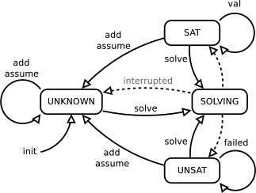

# Implementing IPASIR-UP Interface on MiniSat

Chenqi Hao

2025/02/05

## Introduction

- Incremental SAT Solving
- IPASIR Interface
- IPASIR-UP Interface
- MiniSat

### Incremental SAT Solving

- SAT solvers alone work great

- sometimes a solution needs to be refined: incrementally adding more constraints while keeping solving state
  - adding clauses
  - adding assumptions
  - adding variables

- used within Satisfiability modulo Theories (SMT) solvers or Satisfiability modulo Symmetries (SMS) framework

### IPASIR Interface

(reversed acronym for "Re-entrant Incremental Satisfiability Application Program Interface", proposed for SAT Race 2015)

- solver can be called multiple times and solving state is kept (variable scores, learned clauses, etc)
- user can add more clauses or make assumptions before each solver call

### IPASIR-UP Interface

(Fazekas et al. IPASIR-UP: User Propagators for CDCL)

- allows more control over the solving process from the user:
  - solver: propagating and inprocessing
  - user: deciding, propagating, raising conflicts, etc

was only implemented in CaDiCaL

This work: implementing the interface in MiniSat (as Project) and a fuzzer (as Lab) to ensure correctness.

### MiniSat

- "minimalistic, open-source SAT solver" 
- "Easy to modify" 
- "Highly efficient" 
- "Designed for integration"

- a CDCL Solver (Conflict-Driven Clause Learning) using 2-watching scheme

## Implementation

- Adding Clause during Solving
- External Propagation with Lazy Explanation
- *Watching for a New Clause

### Adding Clause during Solving

- interact with user propagator for new clauses in the CDCL loop
- the new clauses could lead to propagation, conflict or unsat

- clause that is tautology or root-satisfied is ignored
- root-falsified literals are removed
- empty clause leads to unsat
- unit clause leads to propagation
- clause left with at least two literals can lead to propagation or conflict analysis (details later)

### External Propagation with Lazy Explanation

- most propagation are useless and the reason clauses can be expensive to calculate
- lazy explanation:
  - get a propagated literal from user propagater without the reason clause
  - request the reason clause only when the literal needs to be explained during conflict analysis

### Watching for a New Clause

(for clauses with length of at least 2)

- 2-watching scheme:
  - each clause is watched by two non-falsified literals
  - if one watching literal is falsified during propagation, another must be found, or it leads to unit propagation or conflict analysis

- watching for a clause added during solving:
  - sort literals by assignment(true/false/unassigned) and decision level: True(low - high) - Unassigned - False(high - low)
  - watch the first two literals after sorting

### Watching for a New Clause

The first two literals after sorting (respectively of level l1, l2 if assigned)
- unassigned, unassigned (skip)
- unassigned, false:
  - backtrack to level l2
  - propagate
- false, false:
  - l1 > l2:
    - backtrack to level l2
    - propagate
  - l1 = l2:
    - backtrack to level l1 = l2
    - raise current clause as conflict, trigger conflict analysis
- true, unassigned (skip)
- true, false:
  - l1 > l2:
    - backtrack to level l2
    - propagate
  - l1 <= l2 (skip)
- true, true (skip)

### Watching for a New Clause

- for clause lazily added during conflict analysis:
  - similar to adding clause during solving
  - the first two literals are respectively true, false after sorting

(under current implementation, it can't be a root level unit)

remark: CaDiCaL supoorts out-of-order propagation which has more flexibility

## Fuzzing

- test the implementation and ensure the correctness

- implementing the ExternalPropagator interface
- simulating the interaction between MiniSat and ExternalPropagator
- check model

procedure:
- generate random CNF as input (with cnfuzz)
- split clauses for Solver and Propagator
- print proof in DRUP format
- check proof (with drup checker)

### Fuzzing Result

- a bug with the sorting predicate found and fixed early
- a bug found related with lazy propagations when the reason clause of a propagated literal is marked with a placeholder

## Discussion

## End

Thank you!
